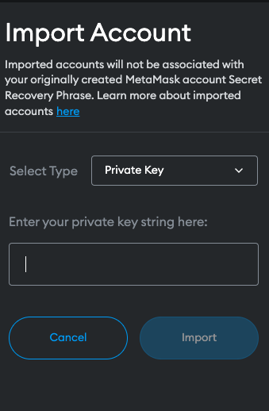

# TURMICRO

### Description:

El objetivo de este proyecto es crear una aplicación web que permita la compra de viajes de Bus con criptomonedas (Basico).


#### tecnologias utilizadas:

- [Vue 3](https://vuejs.org/) </br>
- [Vuex](https://vuex.vuejs.org/) </br>
- [Truffle](https://trufflesuite.com/)</br>
- [Ganache](https://trufflesuite.com/ganache/)</br>
- [Metamask](https://metamask.io/)</br>
- [chrome](https://www.google.com/chrome/browser/desktop/)</br>
- Yarn o npm</br>
- git</br>


### Instalacion:

Abrir chrome y escribir en la barra de busqueda: https://metamask.io/

- Apretar el boton de "descargar metamask"


- Apretar el boton de "añadir a chrome"


- Agregar la extension metamask a chrome


- Abra la extension metamask y apreta el boton "get started"


- Si tienes una cuenta de metamask, puedes iniciar sesion en la extension metamask, o si no tienes una cuenta de metamask, puedes crear una cuenta de metamask.


- Si no tienes cuenta, puedes seguir los pasos de la extension metamask para crear una cuenta de metamask.


- Crea una contraseña para tu cuenta de metamask


- Vea el video y comprueba que todo esta correcto y apreta el boton "next"


1 - Apreta el recuadro de "metamask" y guarda las palabras secretas en un lugar seguro

2 - apreta "next"


Ingresas las palabras secretas en el recuadro de "metamask" y confirmas que estan correctas


y listo!


- Instalación de ganache de https://trufflesuite.com/ganache/

- Cuando lo tengas instalado, abre ganache


- y listo!


- Abrimos la extension de metamask


- Activemos uso de red de prueba en ganache


- ingresamos a "settings"


- Advanced


y busca la opción de "Mostrar conversión en redes de prueba
Seleccione esta opción para mostrar la conversión fiduciaria en las redes de prueba" y activemos la palomita


y mas abajo tambien activemos la palomita de "Mostrar redes de prueba
Seleccione esta opción para mostrar las redes de prueba en la lista de redes"


- cerramos todo y entramos de nuevo a la extension de metamask y apretamos el selector "Ethereum Mainnet"


- Apretamos el boton "Add Network"


- llenemos el formulario con los datos de ganache


- llevamos algunas cuentas de ganache a metamask

- Abrimos Ganache y apretamos el boton de la llave


- Copiamos la llave privada


- Nos vamos nuevamente a la extension de metamask y apretamos el circulo del avatar


- y apretar la opción "Import Account"


- Pega la llave privada en el recuadro de "Private Key"

y importa la cuenta, repita con las otras cuentas de ganache, es opcional si quieres importar mas de una cuenta, solo necesitamos 1 cuenta de ganache



- En mi caso importe dos cuentas


>nota: Verifica que tienes seleccionada la red que creamos, para no tener problemas al importar las cuentas


- Ahora descarga el proyecto TURMICRO

````
cd turmicro

yarn o npm install

yarn build:truffle o npm run build:truffle

yarn migration:truffle o npm run migration:truffle

yarn dev o npm run dev

````

-  y listo para usar la aplicación

# License

Free Software, Hell Yeah!


